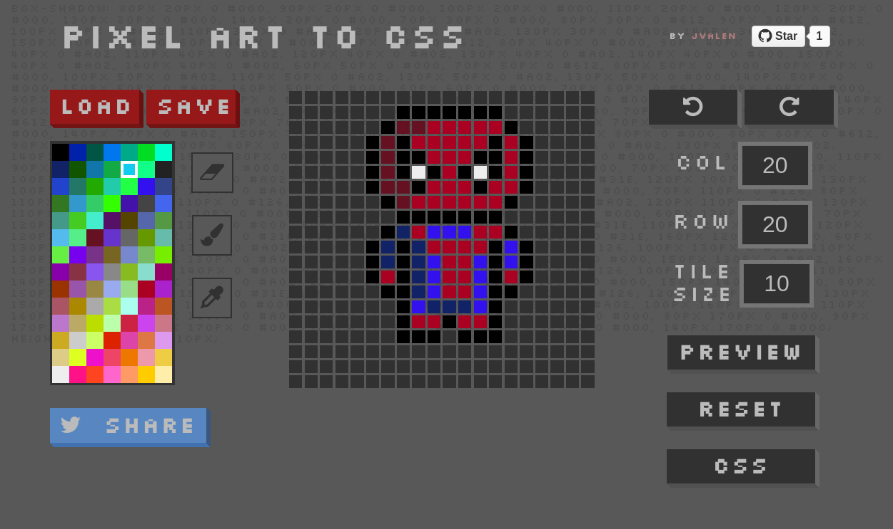

# Pixel-art to CSS with react

<a target='_blank' href='http://www.recurse.com' title='Made at the Recurse Center'></a>

### Did you know that you can create pixel art using a single CSS property?

**pixel-art-react** is a handy and intuitive tool, that can help you to design your awesome drawings!

Try to draw some pixels on the screen, **pixel-art-react** will generate the CSS code using **box-shadow** property, ready to use in your HTML blocks.

Check the following **_mini-pixel-spiderman_** example:



The project is built with **React**, **Redux** and **ImmutableJS**. Trying to avoid side-effects in a functional way of programming.

You will be able to **load** and **save** drawings, **undo** **redo** your actions, change grid properties, **share** your drawings and **download** them, everything in a very easy and fast way.

##### See it live at [pixelart-to-css-react](http://pixelart-to-css-react.herokuapp.com/)
#### Help me to improve it, share and enjoy :)

## Technical overview

This application has been built with the following technoligies:

- [React](https://facebook.github.io/react/) (Library to build the UI)
- [Redux](http://redux.js.org/) (Implement Flux architecture)
- [ImmutableJS](https://facebook.github.io/immutable-js/) Helps to keep the data immutable
- [NodeJS](https://nodejs.org/en/) + [Express](http://expressjs.com/) (Server side to build an universal application, create and serve the generated drawings)

## Installation

```bash
npm run install
```

## Development

If you just want to develop the interface with no need of back-end side, taking advance of ```webpack-dev-server``` and ```react-hot-loader```.

```bash
npm run development
```

## Deploy

Create the final build and run the generated react html on a express server making in an isomorphic/universal way.

```bash
npm run deploy

npm run server
```

A ```config.json``` is needed for deployment with the Twitter and express keys.

## Testing

```bash
npm run test
```
