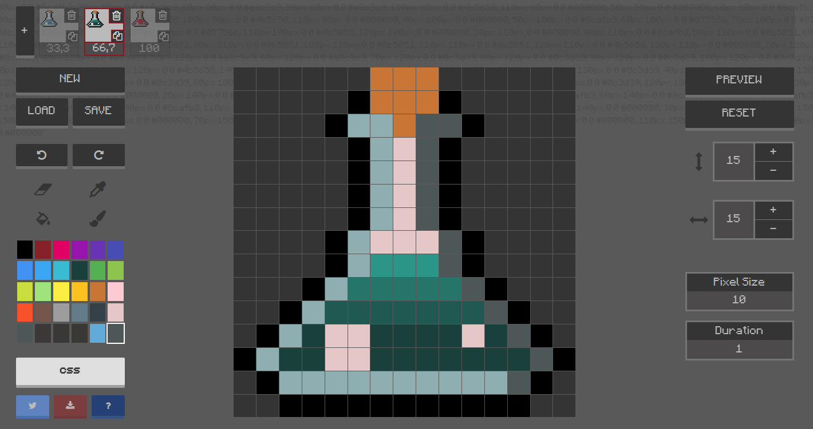

<p align="center">
  
</p>
<h1 align="center">Pixel Art to CSS</h1>
<p align="center">
  <h3 align="center">  
    Web application that allows us to animate pixel art and export the results to CSS.
  </h3>
</p>
<p align="center">
  <a target='_blank' href='http://www.recurse.com' title='Made at the Recurse Center'></a>
  <a href="https://travis-ci.com/jvalen/pixel-art-react"></a>
</p>

## Did you know that you can create pixel art using CSS?

[Try to draw](https://www.pixelartcss.com/) some pixels on the screen, it will generate the CSS code using **box-shadow** property. Create as much drawings as you want adding new frames and then check them in motion. It uses CSS **keyframes** to get the animation done.

<p align="center">
  
</p>

You will be able to **load**, **save**, **import**, **export** projects, **undo** **redo** your actions, change grid properties, **share** your work and **download** it, everything in a very easy and fast way.

## Example

By default, you will find the following project within the <b>LOAD</b> section:


See it live at [pixelartcss](https://www.pixelartcss.com/)

You can also import it directly submitting [this](examples/import-export/cat.txt) code.

## Technical overview

This application has been built with the following technologies:

- [React](https://facebook.github.io/react/): Library to build the UI.
- [Redux](http://redux.js.org/): Implements a Flux like architecture.
- [ImmutableJS](https://facebook.github.io/immutable-js/) Helps to keep the data immutable aiming to avoid side effects.
- [PostCSS](https://github.com/postcss/postcss) Handle the app CSS.
- [NodeJS](https://nodejs.org/en/) + [Express](http://expressjs.com/) (Server side to build an universal application, create and serve the generated drawings).

## Installation

```bash
npm install
```

## Development

If you just want to develop the interface with no need of the back-end side.

```bash
npm run development
```

## Deploy

Create the final build and run the generated react html on a express server using SSR.

```bash
npm run deploy

npm run server
```

A `config.json` is needed for deployment with the Twitter and express keys.

## Lint

There are several libraries used in the project that help us to keep our codebase healthy:

- [ESlint](https://eslint.org/)
- [stylelint](https://stylelint.io/)
- [Prettier](https://prettier.io/)

Every time we commit something it will execute the linters and format the staged files if needed.

If you want to check them individually you could execute the following scripts:

```bash
npm run lint
npm run csslint
npm run format
```

## Testing

We are using [Jest](https://jestjs.io/) as the testing platform.

```bash
npm run test
```

## Contributing

#### Help me to improve it :seedling:

Please create a GitHub issue if there is something wrong or to be improved. Pull requests are also welcome, they should be created to the **develop branch**.

## License

[MIT](https://opensource.org/licenses/mit-license.php)
Copyright © 2016 Javier Valencia Romero (@jvalen)
