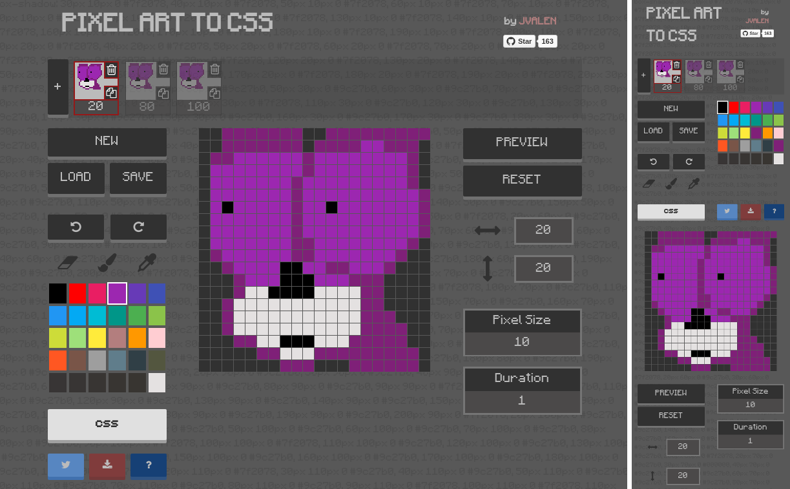

# Pixel Art to CSS

<a target='_blank' href='http://www.recurse.com' title='Made at the Recurse Center'></a>

### Did you know that you can draw and animate pixel art using CSS?

**pixel-art-react** is a handy and intuitive tool, that can help you to design your awesome drawings and animations!

Try to draw some pixels on the screen, **pixel-art-react** will generate the CSS code using **box-shadow** property.

Create as much drawings as you want in your project adding new frames and then check them in motion! it will use CSS **keyframes** to get the animation done and the CSS code will be ready to use in your HTML blocks.

Please check the following example:



The app layout is responsive and adjust itself to the screen width. You can see different layout examples (desktop and mobile) in the screenshot.

The project is built with **React**, **Redux** and **ImmutableJS**. Trying to avoid side-effects in a functional way of programming.

You will be able to **load**, **save**, **import**, **export** projects, **undo** **redo** your actions, change grid properties, **share** your drawings/animations and **download** them, everything in a very easy and fast way.

Check the results of this simple project:


##### See it live at [pixelart-to-css-react](http://pixelart.jvrpath.com/)

## Example

You can find an example project data ready to import [here](examples/import-export/cat.txt).

In addition a project will be loaded by default, check this out clicking on the **LOAD** button. Of course you can delete this project anytime you want.

## Technical overview

This application has been built with the following technologies:

- [React](https://facebook.github.io/react/): Library to build the UI
- [Redux](http://redux.js.org/): Implements a Flux like architecture
- [ImmutableJS](https://facebook.github.io/immutable-js/) Helps to keep the data immutable
- [PostCSS](https://github.com/postcss/postcss) Handle the app CSS
- [NodeJS](https://nodejs.org/en/) + [Express](http://expressjs.com/) (Server side to build an universal application, create and serve the generated drawings)

## Installation

```bash
npm install
```

## Development

If you just want to develop the interface with no need of back-end side, take advance of ```webpack-dev-server``` and ```react-hot-loader```.

```bash
npm run development
```

## Deploy

Create the final build and run the generated react html on a express server making in an isomorphic way.

```bash
npm run deploy

npm run server
```

A ```config.json``` is needed for deployment with the Twitter and express keys.

## Testing

```bash
npm run test
```

## Contributing
#### Help me to improve it, share and enjoy :)
Please create a Github issue if there is something wrong or to be improved. Pull request are also welcome and they can be created to the develop branch.


## License

[MIT](https://opensource.org/licenses/mit-license.php)
Copyright © 2016 Javier Valencia Romero (@jvalen)
